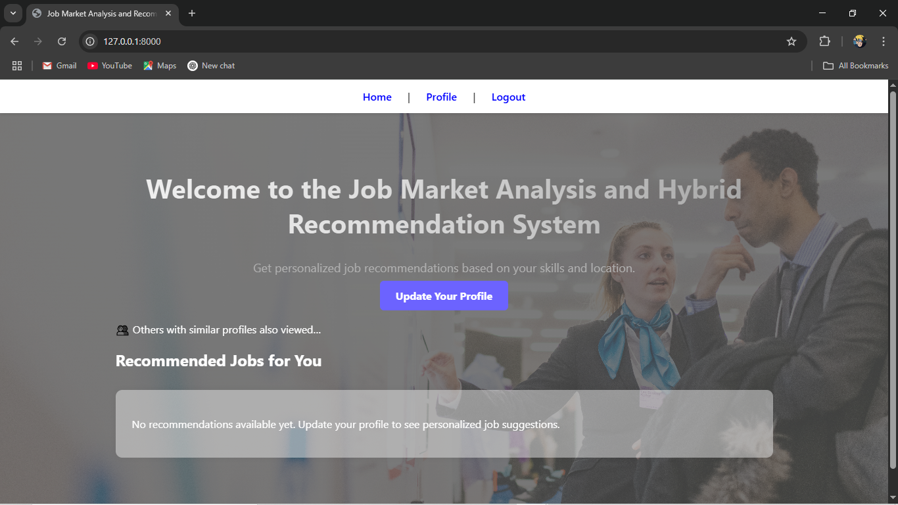
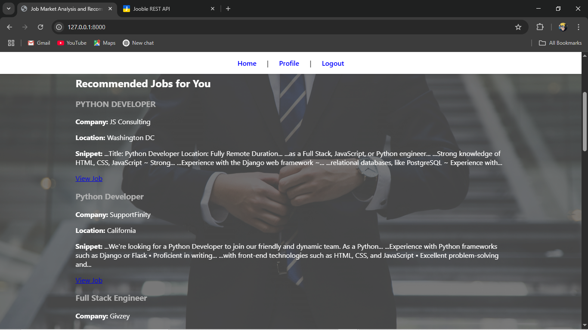
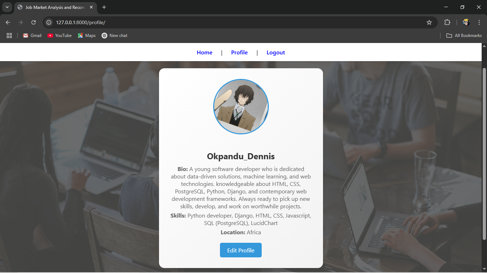
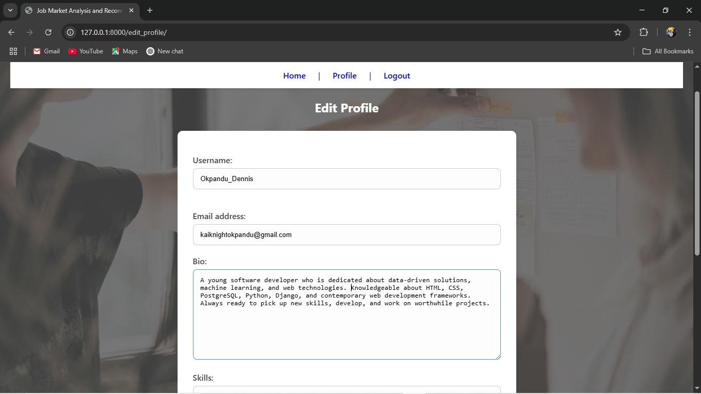
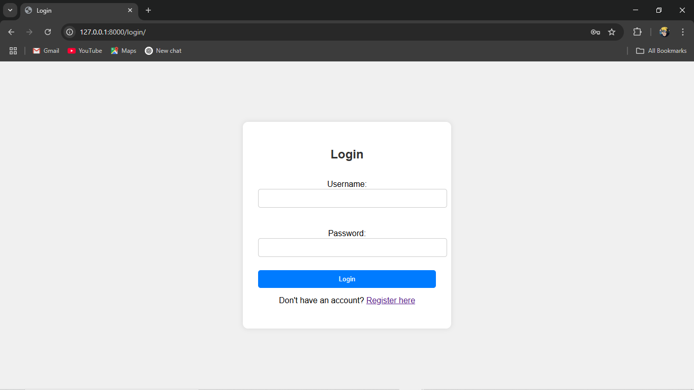
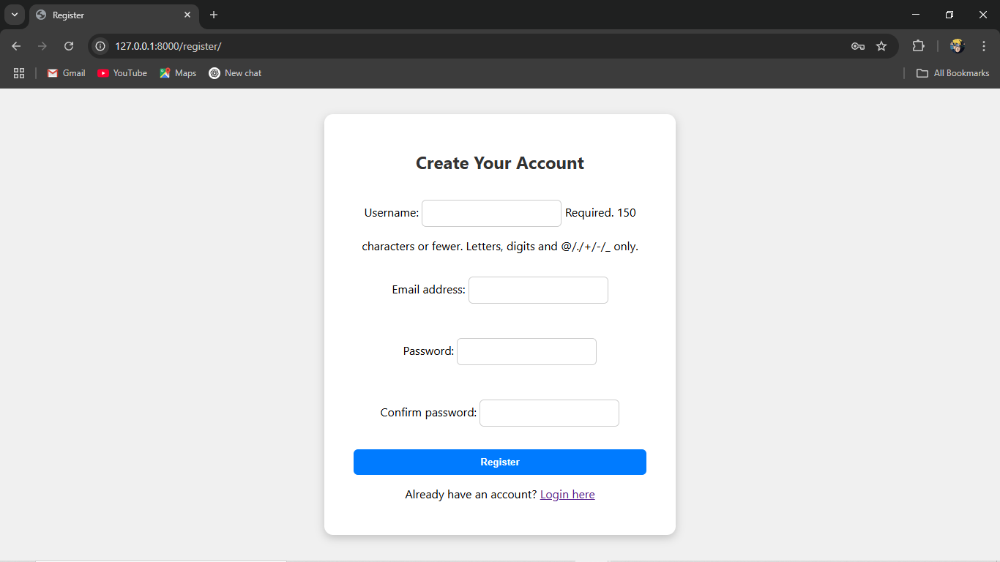

# job_market_recommendation_system-live-data- 
This project is a Django-based web application that helps users find personalized job recommendations based on their skills, location, and real-time job data fetched using the Jooble API.

## 🧰 Tech Stack

- **Backend:** Django (Python)
- **Database:** PostgreSQL (host)
- **Frontend:** HTML and CSS
- **APIs Used:** Jooble API

## ✨ Features

- Real-time job search with live listings from Jooble API
- Smart job matching based on user input
- Clean, responsive design for both desktop and mobile
- User authentication system (Register / Login / Logout)
- Admin panel via Django Admin for content control

Screenshots
  
Landing page for exploring job recommendations

  
Recommendation Page

  
Search Page

  
Profile Page

  
Edit Profile Page

  
Login Page

  
Register Page
