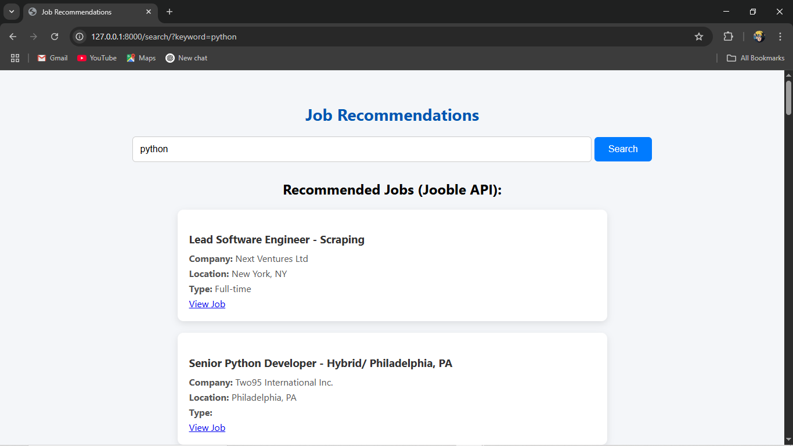

# job_market_recommendation_system-live-data- 
This project is a Django-based web application that helps users find personalized job recommendations based on their skills, location, and real-time job data fetched using the Jooble API.

Screenshots
  
Landing page for exploring job recommendations

  
Recommendation Page

  
Search Page

  
Profile Page

  
Edit Profile Page

  
Login Page

  
Register Page
